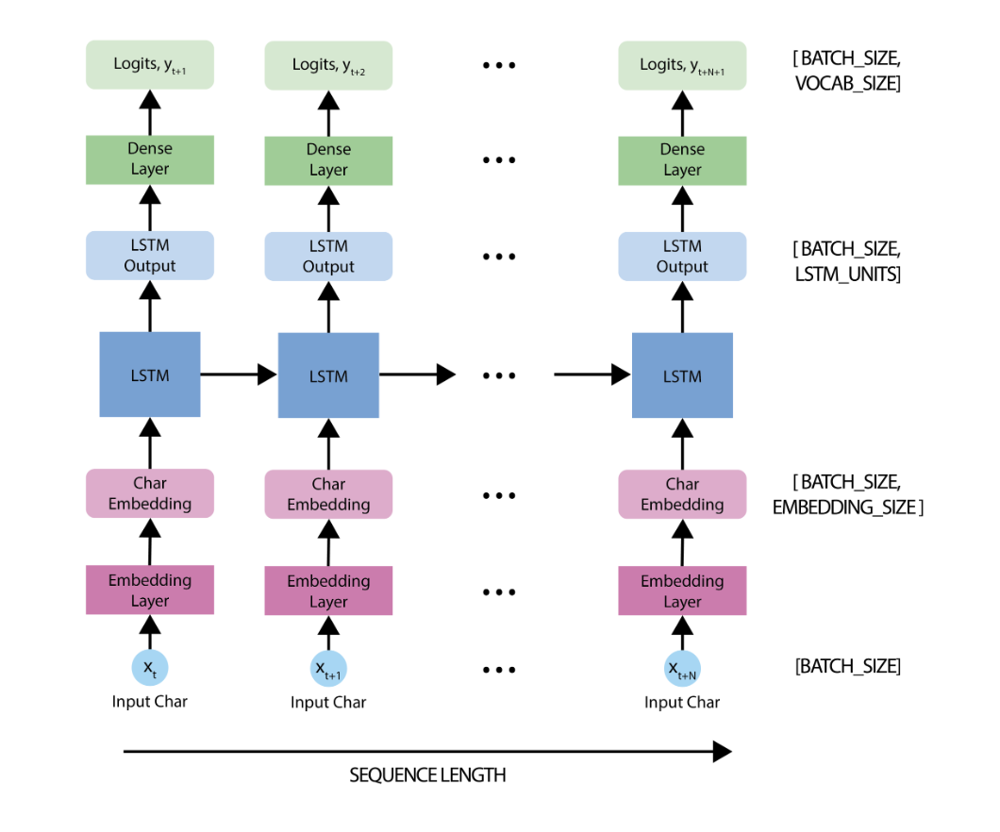
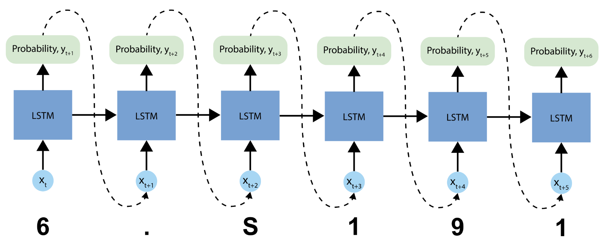
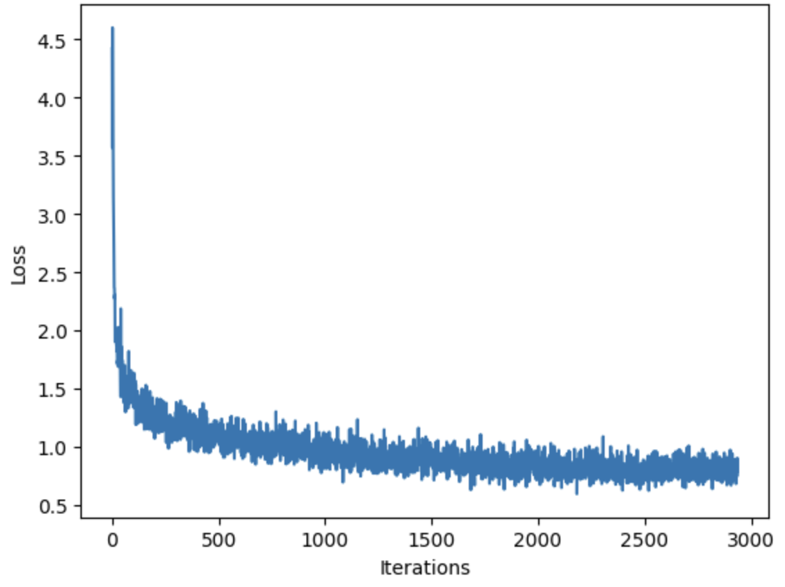

# Lab 1 

**Contents**

[**Part 1: Introduction to PyTorch**](https://github.com/Prashanna-Raj-Pandit/DeepLearning-MIT/blob/main/Lab1/PT_Part1_Intro.ipynb) 

[**Part2 : Music Generation using RNN**](https://github.com/Prashanna-Raj-Pandit/DeepLearning-MIT/blob/main/Lab1/PT_Part2_Music_Generation.ipynb)

### 🔊 Listen to the Output
[Click to listen](./output_10.mp3)
<audio controls>
  <source src="./output_10.wav" type="audio/wav">
</audio>

This project implements a character-level music generation model using Recurrent Neural Networks (RNNs), specifically LSTM (Long Short-Term Memory) units, trained on symbolic music data. It is inspired by models used in text generation, adapted to musical sequences ( ABC notation).

### The RNN Model

The model is based off the LSTM architecture, where we use a state vector to maintain information about the temporal relationships between consecutive characters. The final output of the LSTM is then fed into a fully connected linear nn.Linear layer where we'll output a softmax over each character in the vocabulary, and then sample from this distribution to predict the next character.

we use PyTorch's nn.Module to define the model. Three components are used to define the model:

* nn.Embedding: This is the input layer, consisting of a trainable lookup table that maps the numbers of each character to a vector with embedding_dim dimensions.
* nn.LSTM: Our LSTM network, with size hidden_size.
* nn.Linear: The output layer, with vocab_size outputs.

Input:         (B, L)             # Batch of sequences (token indices)

Embedding:     (B, L, D)          # Each token becomes a D-dim vector

LSTM:          (B, L, H)          # Hidden representations from context

FC Layer:      (B, L, V)          # Project to vocabulary logits

### Prediction Procedure:

* Initialize a "seed" start string and the RNN state, and set the number of characters we want to generate.

* Use the start string and the RNN state to obtain the probability distribution over the next predicted character.

* Sample from multinomial distribution to calculate the index of the predicted character. This predicted character is then used as the next input to the model.

* At each time step, the updated RNN state is fed back into the model, so that it now has more context in making the next prediction. After predicting the next character, the updated RNN states are again fed back into the model, which is how it learns sequence dependencies in the data, as it gets more information from the previous predictions.

### Training Loss
