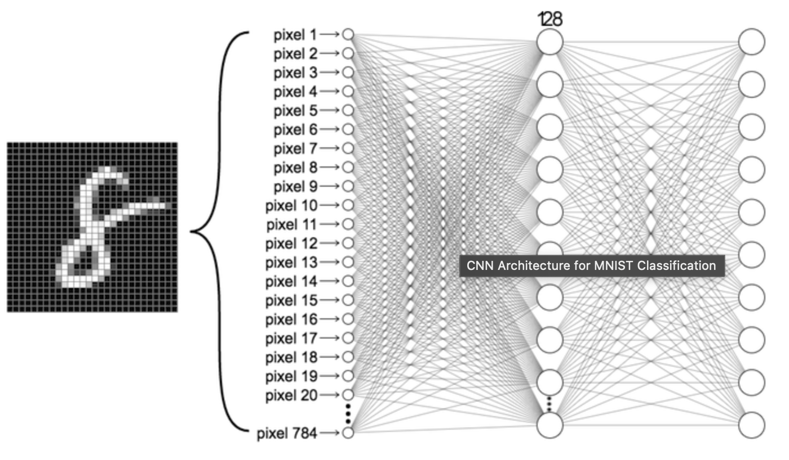
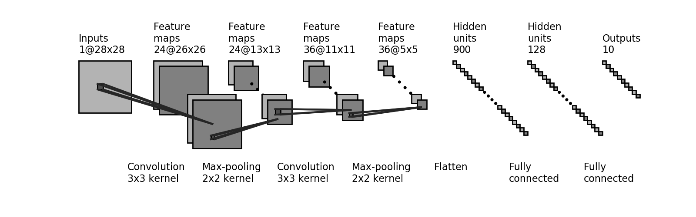
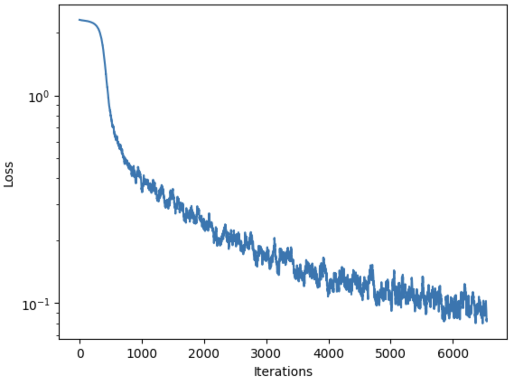
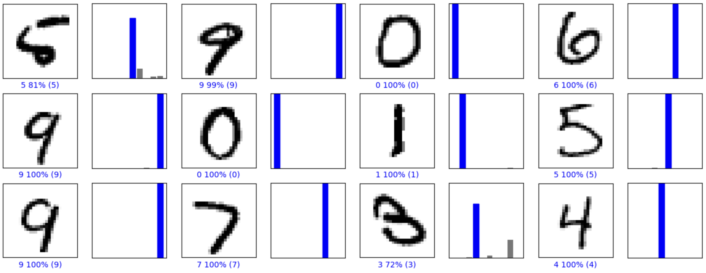
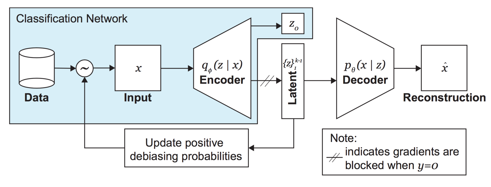
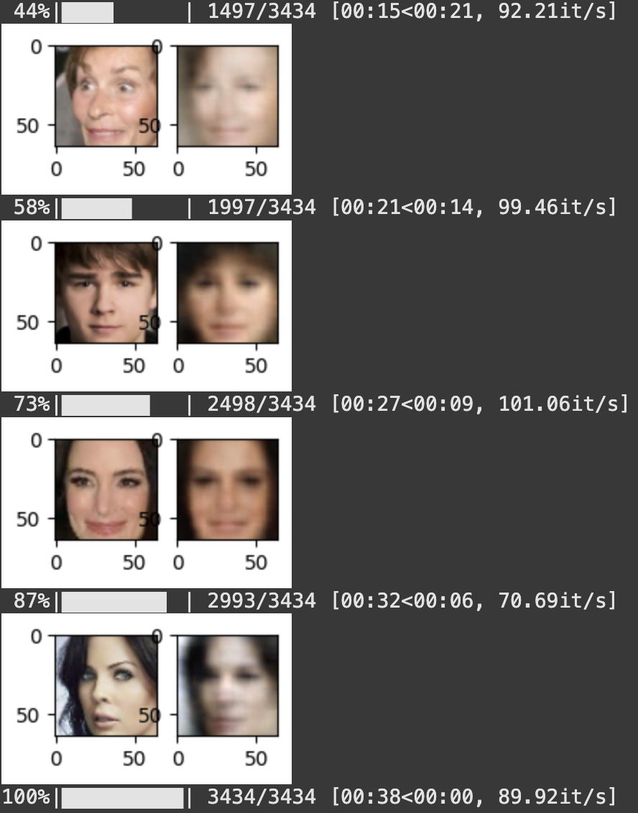

# Lab 2

**Contents**

* [CNN for handwritten digit classification](https://github.com/Prashanna-Raj-Pandit/DeepLearning-MIT/blob/main/Lab2/PT_Part1_MNIST.ipynb)
* [Debiasing Facial Detection Systems](https://github.com/Prashanna-Raj-Pandit/DeepLearning-MIT/blob/main/Lab2/PT_Part2_Debiasing.ipynb)
___

# CNN for handwritten digit classification

</img>
### CNN Architecture

1. **Input Layer**

    Shape: (1, 28, 28) — A single grayscale image from MNIST.
    
    Purpose: Pass the raw pixel data into the network.

2. **First Convolutional Layer (conv1)**

    Applies 24 different 3×3 filters to the input image.
    
    Output shape: (24, 26, 26) — each filter detects local patterns (like edges or textures).

3. **ReLU Activation**
    
    ntroduces non-linearity.

    Enables the network to learn complex patterns (not just linear ones).

4. **First Max Pooling Layer (pool1)**

    Reduces spatial dimensions by half (downsampling).  
    
    Output shape: (24, 13, 13)

5. **Second Convolutional Layer (conv2)**

    Applies 36 new filters to the 24 pooled feature maps.
    
    Output shape: (36, 11, 11)
    
    Extracts deeper features from the already-learned patterns.

6. **ReLU Activation (again)** Non-linearity continues to be applied between each stage.

7. **Second Max Pooling Layer (pool2)**

    Downsamples again to reduce spatial size.

    Output shape: (36, 5, 5) — because 11 // 2 = 5 (floor division)

8. **Flatten Layer**

    Converts the 3D tensor (36, 5, 5) into a flat 1D vector of size 900. This is done because Fully connected (dense) layers require 1D input.

9. **Fully Connected Layer 1 (fc1)**
    
    Maps the 900 extracted features to 128 high-level representations. It Acts like a decision-making layer that learns complex feature combinations.

10. **ReLU Activation**

    Non-linearity again after dense layer to allow complex combinations.

11. **Final Output Layer (fc2)**

    Maps 128 hidden features to 10 output logits.

### Training Loss
</img>

### Results

The vertical bar shows the confidence level. The blue bar shows the model is highly confident in predicting the numbers.

</img>

---
## The DB-VAE model

The key idea behind this debiasing approach is to use the latent variables learned via a VAE to adaptively re-sample the CelebA data during training. Specifically, we will alter the probability that a given image is used during training based on how often its latent features appear in the dataset. So, faces with rarer features (like dark skin, sunglasses, or hats) should become more likely to be sampled during training, while the sampling probability for faces with features that are over-represented in the training dataset should decrease (relative to uniform random sampling across the training data).

