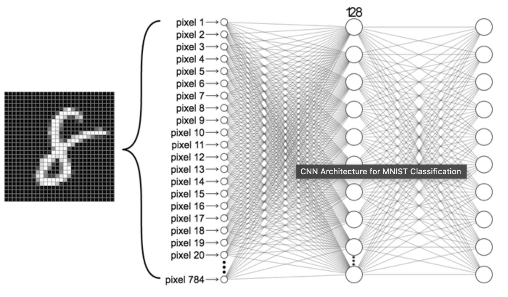

# DeepLearning-MIT

[**Lab 1 : Music Generation using RNN**](https://github.com/Prashanna-Raj-Pandit/DeepLearning-MIT/blob/main/Lab1/PT_Part2_Music_Generation.ipynb)

[**Lab 2: MNIST Digit Classification using CNN**](https://github.com/Prashanna-Raj-Pandit/DeepLearning-MIT/blob/main/Lab2/PT_Part1_MNIST.ipynb)

